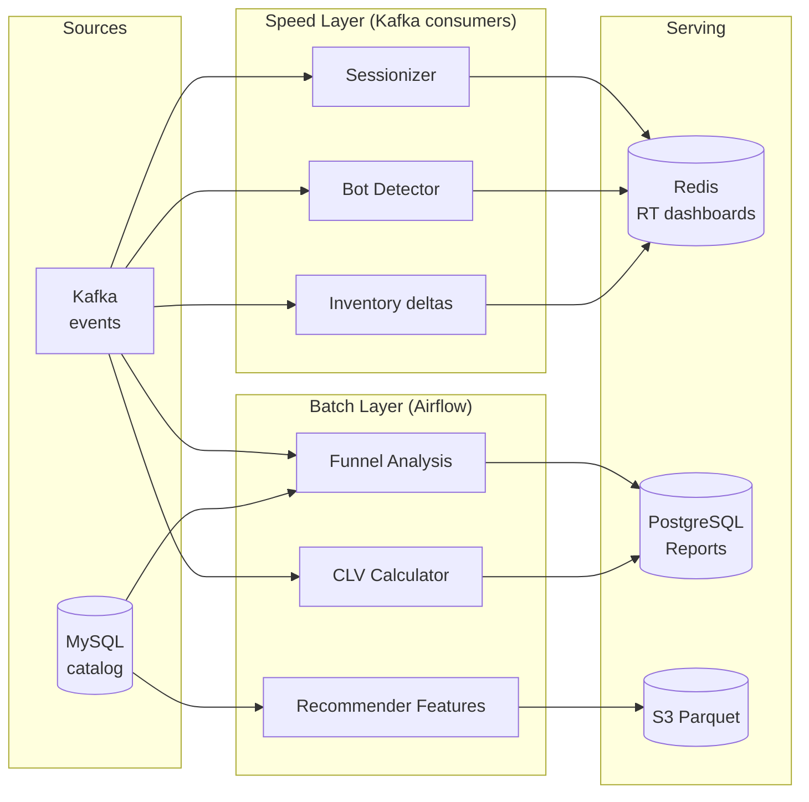

# Commerce Analytics Architecture

## Lambda Architecture

## Exactly-Once Guarantees

| Source | Mechanism |
|--------|-----------|
| Kafka  | `isolation.level=read_committed` + manual offset commit |
| Sinks  | Idempotent keys (`session_id`, `customer_id`) + upserts |
| State  | Sessionizer flushes via Redis pipeline with WATCH/MULTI |

## Latency Targets

- Speed layer: < 500ms p95
- Batch layer: < 30 min for daily windows
- Dashboard refresh: < 5s (Redis HSET reads)
